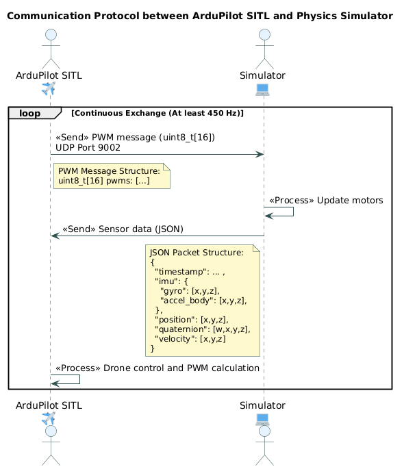

# PyArduPilotPlugin
Implementation of the communication protocol between ArduPilot SITL and a physics simulator.
This project is particularly useful if you want to develop your own simulator and integrate it with ArduPilot.



## Installation
```bash
pip install .
```

## Usage
Run ArduPilot SITL with JSON SITL interface:
```bash
sim_vehicle.py -v ArduCopter -f gazebo-iris --mode JSON --console --map
```

Run script:
```python
import time
from ArduPilotPlugin import ArduPilotPlugin

ap = ArduPilotPlugin()
ap.drain_unread_packets()

sim_time = time.time()
while True:
    dt = time.time() - sim_time
    ap.pre_update(sim_time=dt)
    ap.post_update(sim_time=dt, sensor_data=ap.SensorData())
    time.sleep(0.01)
```

## Resources
This communication module has been rewritten in Python, based by the original C++ code from the Gazebo and ArduPilot projects.

- **ardupilot_gazebo**: [ArduPilotPlugin.cpp](https://github.com/ArduPilot/ardupilot_gazebo/blob/main/src/ArduPilotPlugin.cc)
- **ArduPilot**: [SIM_Gazebo.cpp](https://github.com/ArduPilot/ardupilot/blob/master/libraries/SITL/SIM_Gazebo.cpp)
- **ArduPilot JSON SITL interface**: [JSON SITL interface](libraries/SITL/examples/JSON/readme.md)
