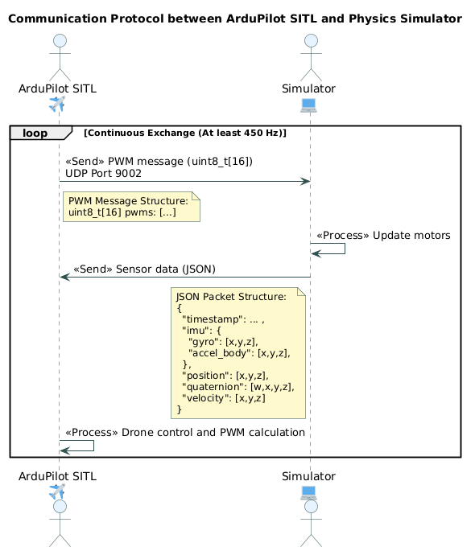

# PyArdupilotPlugin
Implementation of the communication protocol between ArduPilot SITL and a physics simulator.
This project is particularly useful if you want to develop your own simulator and integrate it with ArduPilot.

## Resources
This communication module has been rewritten in Python, based by the original C++ code from the Gazebo and ArduPilot projects.

- **ardupilot_gazebo**: [ArduPilotPlugin.cpp](https://github.com/ArduPilot/ardupilot_gazebo/blob/main/src/ArduPilotPlugin.cc)
- **ArduPilot**: [SIM_Gazebo.cpp](https://github.com/ArduPilot/ardupilot/blob/master/libraries/SITL/SIM_Gazebo.cpp)
- **ArduPilot JSON SITL interface**: [JSON SITL interface](libraries/SITL/examples/JSON/readme.md)
